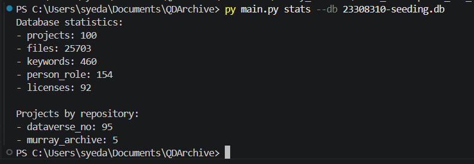

# Seeding_QDArchive

- **Student:** Sayeda Fatema Tuj Zohura  
- **Student ID:** 23308310  
- **Project:** Applied Software Engineering Master's Project  
- **Supervisor:** Prof. Dr. Dirk Riehle  
- **University:** Friedrich-Alexander-Universität Erlangen-Nürnberg (FAU)

## Project Overview

This project implements a data acquisition pipeline for collecting and organizing **Qualitative Data Analysis (QDA)** datasets from multiple research repositories.

The pipeline:

* Searches repositories for relevant datasets
* Extracts and stores metadata
* Downloads dataset files
* Organizes files into a structured folder system

The pipeline searches for datasets compatible with the following **Qualitative Data Analysis (QDA)** software packages and file formats:

- **REFI-QDA Standard** (`.qdpx`, `.qdc`)  
- **MAXQDA** (`.mx`, `.mx24`, `.mx22`, `.mx20`)  
- **NVivo** (`.nvp`, `.nvpx`)  
- **ATLAS.ti** (`.atlproj`, `.hpr7`)  
- **QDA (Generic / Other tools)** (`.qda`, `.rqda`, `.qdp`, `.qel`)  
- **QDA Miner** (`.ppj`, `.pprj`, `.qlt`)  
- **f4analyse** (`.f4p`)  

It includes:

- **Multi-repository data acquisition** using APIs (DataverseNO) and manual collection (Murray Archive)  
- **Metadata extraction and storage** in a structured SQLite database  
- **SQLite database (23308310-seeding.db)** containing **100 projects and 25,655 files**  
- **Automated download pipeline** for retrieving dataset files from Dataverse repositories  
- **Manual dataset integration** for repositories without API support (Murray Archive)  
- **Organized folder structure** for efficient dataset storage and access  
- **Scalable pipeline design** for extending to additional repositories

## Repositories

| ID | Name            | URL |
|----|-----------------|-----|
| 1  | DataverseNO     | [https://dataverse.no](https://dataverse.no) |
| 2  | Murray Archive  | [https://www.murray.harvard.edu](https://www.murray.harvard.edu) |

##  Query Strategy

The pipeline uses a set of predefined search queries to retrieve relevant QDA datasets from repositories.

### Default Queries

The following keywords are used as initial search queries:

- `qdpx`  
- `maxqda`  
- `interview study`  

These queries are selected to target datasets commonly associated with **Qualitative Data Analysis (QDA)** workflows and tools.

---

## Skipped File Types

To ensure relevance and reduce unnecessary downloads, the pipeline excludes certain file types that are not directly useful for QDA analysis.

### Ignored Extensions

- **Video formats:** `.mp4`, `.mov`, `.avi`, `.mkv`, `.wmv`, `.flv`, `.m4v`, `.webm`  
- **Audio formats:** `.mp3`, `.wav`, `.aac`, `.flac`, `.ogg`, `.wma`, `.m4a`  

### Rationale

These file types are skipped because:

- They are typically **raw media files**, not structured QDA project data  
- They significantly increase storage size  
- They are not directly usable in QDA tools without preprocessing  

This filtering improves:

-  Download efficiency  
-  Storage optimization  
-  Dataset relevance  

---

---
## Pipeline Diagram

```
+---------------------+
|  User Input Query   |
|  (e.g., "maxqda")   |
+----------+----------+
           |
           v
+-----------------------------+
|   Dataverse API Search      |
|   (dataverse.no)            |
+-------------+---------------+
              |
              v
+-----------------------------+
|  Metadata Extraction        |
|  (title, DOI, author, etc.)|
+-------------+---------------+
              |
              v
+-----------------------------+
|  Store in SQLite Database   |
|  (projects, files, etc.)    |
+-------------+---------------+
              |
              v
+-----------------------------+
|  Download Dataset Files     |
|  (organized in folders)     |
+-------------+---------------+
              |
              v
+-----------------------------+
|  Manual Input (Murray)      |
|  (metadata + files)         |
+-------------+---------------+
              |
              v
+-----------------------------+
|  Final Structured Archive   |
|  (clean folder system)      |
+-----------------------------+
```

## Database Summary

| Repository     | Projects | Files     |
| -------------- | -------- | --------- |
| DataverseNO    | 95       | 25650     |
| Murray Archive | 5        | 5         |
| **Total**      | **100**  | **25655** |

---

The project uses an SQLite database to store all collected metadata in a structured format:

```
23308310-seeding.db
```

It contains:

* Projects metadata
* Files information
* Keywords
* Licenses
* Person roles

---

## Folder Structure

```
QDArchive/
├── main.py
├── 23308310-seeding.db
├── downloaded/
│   ├── dataverse_no/
│   │   ├── doi_.../
│   │   └── ...
│   └── murray_archive/
│       ├── Baltimore_Longitudinal_Study_...
│       └── ...
```

---

## Dataset Access

Due to large file size (~87GB), datasets are stored externally.

Access datasets here:
 **[(https://faubox.rrze.uni-erlangen.de/getlink/fiLyHzLbH2cKweyYLbvF7t/)]**

---

## How to Run

```bash
python main.py stats --db 23308310-seeding.db
```

---

## Technologies Used

* Python
* SQLite
* Dataverse API
* PowerShell (for file handling)

---

## Database Statistics (Execution Output)



---


